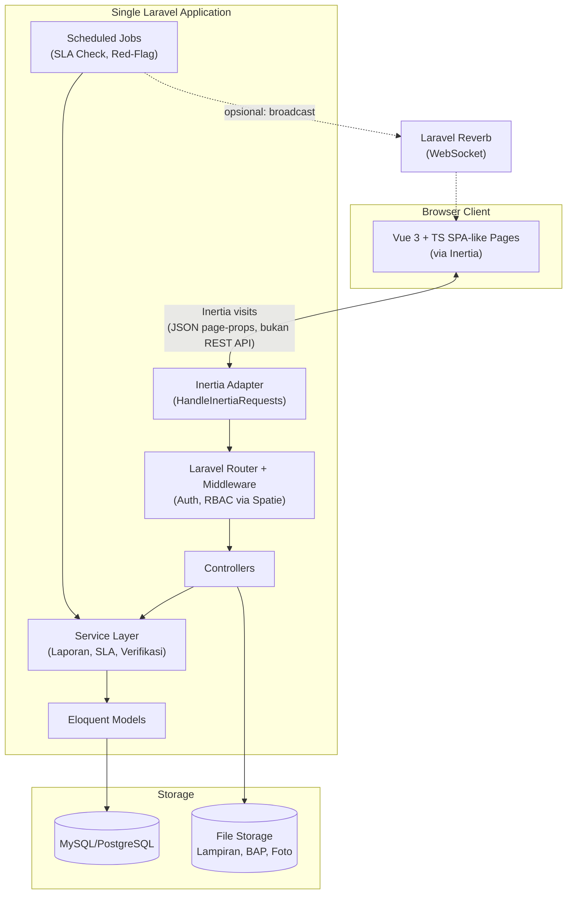
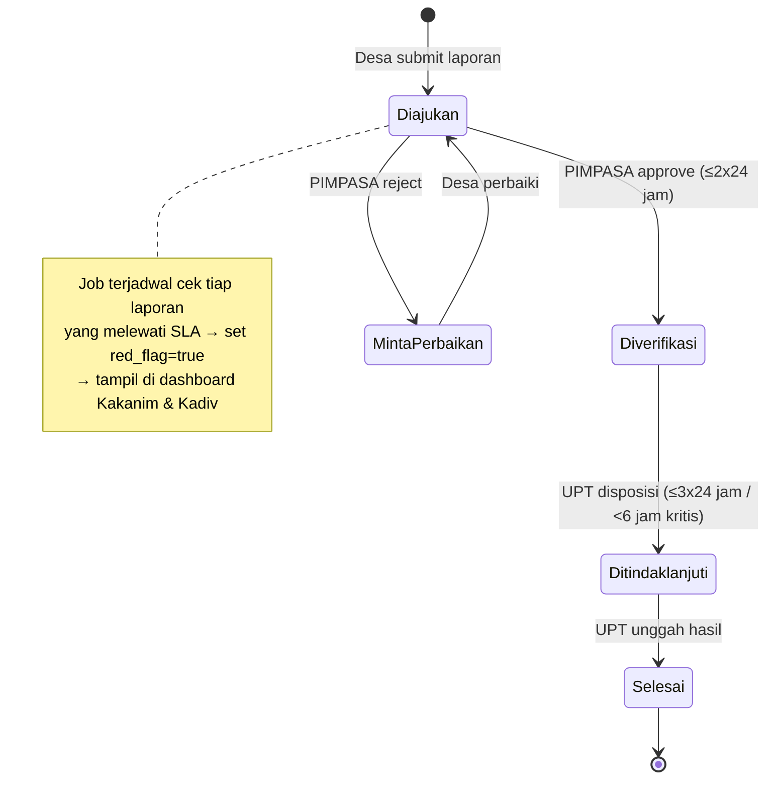

# SIMPEL DBI — Architecture Document

**Sistem Informasi Monitoring dan Pelaporan Desa Binaan Imigrasi**
Kantor Wilayah Ditjen Imigrasi Sumatera Utara

---

## 1. Ringkasan Sistem

SIMPEL DBI adalah sistem pelaporan berjenjang yang menghubungkan 4 aktor — Perangkat Desa Binaan, PIMPASA, Kantor Imigrasi (UPT), dan Kantor Wilayah (Kanwil) — melalui satu alur laporan dengan status baku (Diajukan → Diverifikasi → Ditindaklanjuti → Selesai), SLA otomatis, dan dashboard eksekutif berbasis data geospasial.

Skala pengguna: ±240–253 akun (171 Desa, 53 PIMPASA, 11–22 UPT, 5–7 Kanwil). Ini adalah aplikasi internal (login-only), bukan situs publik — desain arsitektur dioptimalkan untuk kesederhanaan operasional dan kecepatan development, bukan skala masif.

---

## 2. Tech Stack

| Layer | Teknologi | Alasan |
|---|---|---|
| Backend framework | **Laravel 13** | RBAC, auth session, business logic, scheduler |
| Bridge frontend-backend | **Inertia.js v3** | Server-driven SPA, tanpa REST API terpisah |
| Frontend framework | **Vue 3 (Composition API)** | Reaktivitas, komponen, sudah diputuskan sebagai pilihan eksplorasi |
| Bahasa frontend | **TypeScript** | Type safety untuk struktur data laporan yang kompleks |
| Build tool / package manager | **Bun** | Install & build lebih cepat, dipakai di tahap dev/build saja |
| Styling | **Tailwind CSS v4** | Utility-first, konsisten dengan shadcn-vue |
| Component library | **shadcn-vue** (di atas Reka UI + Tailwind) | Copy-paste, full ownership kode, cocok untuk dashboard admin |
| Validasi skema | **Zod** | Type-safe schema, dipakai di frontend & bisa disinkron ke backend |
| Form binding | **vee-validate** + `@vee-validate/zod` | Zod sendiri bukan form-state manager, perlu adapter ini |
| Tabel data | **Tanstack Table** (`@tanstack/vue-table`) | Sorting/filtering/pagination kompleks untuk worklist & rekap |
| Grafik dashboard | **Unovis** (`@unovis/vue`) | Chart resmi yang dipakai shadcn-vue, konsisten visual |
| Peta geospasial | **Leaflet** + `vue-leaflet` | Gratis, tanpa API key, cukup untuk pin + layer warna |
| Kompresi gambar client-side | `browser-image-compression` | Hemat kuota upload dari desa dengan sinyal terbatas |
| State management client | **Pinia** (opsional) | UI state lokal (sidebar, filter belum submit) di luar Inertia props |
| Ikon | `lucide-vue-next` | Default ekosistem shadcn-vue |
| RBAC | `spatie/laravel-permission` | Role & permission granular, 4 level akses |
| Export PDF | `barryvdh/laravel-dompdf` atau `spatie/browsershot` | Laporan dinas resmi format PDF |
| Export Excel | `maatwebsite/laravel-excel` | Rekapitulasi tabel siap-olah |
| Notifikasi SLA real-time (opsional) | **Laravel Reverb** | WebSocket resmi Laravel, self-hosted gratis |
| Job scheduler | **Laravel Scheduler + Queue** | Cek SLA breach & red-flag otomatis |
| Database | **MySQL / PostgreSQL** | Relational, cocok untuk data hierarkis (wilayah, laporan) |
| Testing | **Pest** | Unit & feature test Laravel |

---

## 3. Arsitektur Tingkat Tinggi



Prinsip kunci: **satu aplikasi, satu server, satu sistem auth.** Tidak ada REST API terpisah, tidak ada deployment ganda (beda dengan skenario Nuxt + Laravel API yang sempat dipertimbangkan dan ditolak karena menambah kompleksitas tanpa kebutuhan SEO/multi-client).

---

## 4. Struktur Folder (Ringkas)

```
simpel-dbi/
├── app/
│   ├── Models/
│   │   ├── User.php
│   │   ├── DesaBinaan.php
│   │   ├── Upt.php
│   │   ├── WilayahAdministratif.php
│   │   ├── Laporan.php
│   │   ├── LaporanVerifikasi.php
│   │   ├── LaporanTindakLanjut.php
│   │   ├── KegiatanPembinaan.php
│   │   └── Lampiran.php
│   ├── Http/
│   │   ├── Controllers/
│   │   │   ├── Desa/LaporanController.php
│   │   │   ├── Pimpasa/VerifikasiController.php
│   │   │   ├── Pimpasa/PembinaanController.php
│   │   │   ├── Upt/DisposisiController.php
│   │   │   ├── Upt/PenugasanPimpasaController.php
│   │   │   ├── Kanwil/DashboardController.php
│   │   │   ├── Kanwil/MasterDataController.php
│   │   │   └── Kanwil/ExportController.php
│   │   └── Middleware/
│   │       └── EnsureRolePermission.php (via Spatie)
│   ├── Services/
│   │   ├── SlaService.php
│   │   ├── LaporanWorkflowService.php
│   │   └── GeospatialAggregationService.php
│   └── Console/Commands/
│       └── CheckSlaBreaches.php   (dijadwalkan via Kernel/Scheduler)
├── database/migrations/
├── resources/
│   └── js/
│       ├── Pages/
│       │   ├── Desa/{Dashboard,LaporanForm,RiwayatTiket}.vue
│       │   ├── Pimpasa/{Worklist,PembinaanForm,Rekap}.vue
│       │   ├── Upt/{Dashboard,Disposisi,PenugasanPimpasa}.vue
│       │   └── Kanwil/{ExecutiveDashboard,PetaGeospasial,MasterData}.vue
│       ├── Components/
│       │   ├── ui/            (komponen shadcn-vue)
│       │   ├── LaporanStatusBadge.vue
│       │   ├── SlaRedFlag.vue
│       │   └── MapDesaBinaan.vue
│       ├── composables/
│       │   ├── useSlaCountdown.ts
│       │   └── useImageCompression.ts
│       ├── types/
│       │   └── models.d.ts     (tipe TS untuk Laporan, User, dsb — sinkron dengan skema Zod)
│       └── app.ts
└── routes/
    └── web.php   (grouped by role + middleware permission)
```

---

## 5. RBAC & Middleware

Menggunakan `spatie/laravel-permission` dengan 4 role:

| Role | Middleware Group | Scope Query Default |
|---|---|---|
| `desa` | `role:desa` | `Laporan::where('desa_id', auth()->user()->desa_id)` |
| `pimpasa` | `role:pimpasa` | `Laporan::whereIn('desa_id', $pimpasa->desaBinaan->pluck('id'))` |
| `upt` | `role:upt` | `Laporan::whereIn('desa_id', $upt->desaBinaan()->pluck('id'))` (semua desa di wilayah UPT) |
| `kanwil` | `role:kanwil` | Tanpa scope — full visibility |

Setiap controller menerapkan **global scope** di query berdasarkan role, bukan hanya menyembunyikan UI — ini penting karena dokumen spesifikasi eksplisit menyebut batasan visibilitas data per level (Bab III).

---

## 6. Skema Database Inti

```
users
  id, name, email, password, role, desa_id (nullable),
  pimpasa_nip (nullable), upt_id (nullable)

wilayah_administratif
  id, parent_id (self-relation), nama, level (provinsi/kabupaten/kecamatan/desa), kode_kemendagri

upt
  id, nama, wilayah_id

desa_binaan
  id, nama, wilayah_id, upt_id, pimpasa_id, lat, lng, sk_desa_binaan_file

laporan
  id, kode_tiket (auto), desa_id, kategori (enum),
  judul, tanggal_kejadian, lokasi_detail, kronologi,
  estimasi_jumlah_orang, status (enum: diajukan/diverifikasi/ditindaklanjuti/selesai),
  submitted_at, verified_at, followed_up_at, resolved_at,
  sla_breached (bool), red_flag (bool)

laporan_verifikasi
  id, laporan_id, pimpasa_id, checklist_json,
  catatan, keputusan (enum: diverifikasi/minta_perbaikan/ditolak)

laporan_tindak_lanjut
  id, laporan_id, seksi (intelkim/wasdakim), bentuk_intervensi,
  ringkasan_hasil, status_akhir (dalam_proses/selesai), berkas_bap

kegiatan_pembinaan
  id, pimpasa_id, desa_id, jenis_pembinaan, tanggal, jumlah_peserta,
  ringkasan_materi

lampiran (polymorphic: lampiranable_id, lampiranable_type)
  id, path, tipe_file, ukuran
```

SLA dihitung dari selisih `submitted_at` → `verified_at` (target ≤48 jam) dan `verified_at` → `followed_up_at`/`resolved_at` (target ≤72 jam umum, <6 jam kategori TPPO/TPPM).

---

## 7. Alur Kerja Laporan & SLA



Implementasi: `Console/Commands/CheckSlaBreaches.php` dijadwalkan tiap 15–30 menit via Laravel Scheduler, meng-update kolom `sla_breached`/`red_flag`, opsional broadcast via Reverb ke dashboard yang sedang terbuka.

---

## 8. Modul per Aktor

**Desa Binaan Portal**
- Form pengajuan laporan (Zod schema + vee-validate, upload dengan kompresi client-side sebelum submit)
- Riwayat & status tiket (badge status, catatan interaktif dari PIMPASA)

**PIMPASA Officer Workspace**
- Worklist verifikasi (Tanstack Table, filter per status/desa)
- Form kegiatan pembinaan mandiri
- Rekap performa pembinaan personal

**UPT (Kantor Imigrasi) Management**
- Dashboard pengawasan satuan kerja (indikator SLA per desa)
- Disposisi & tindak lanjut (upload BAP)
- Penugasan PIMPASA & zonasi desa

**Kanwil Executive Center**
- Executive dashboard (KPI cards, grafik tren via Unovis)
- Peta geospasial (Leaflet, pin warna hijau/kuning/merah per status desa)
- Filter multi-dimensi (satuan kerja, wilayah, kategori, rentang waktu)
- Export PDF/Excel (dompdf/browsershot + laravel-excel)
- Master data (UPT, wilayah, PIMPASA, akun pengguna)

---

## 9. Keamanan & Audit

- Semua perubahan status laporan dicatat sebagai audit trail (bisa pakai `spatie/laravel-activitylog` — tambahan opsional bila dibutuhkan Bab I poin "e" soal ketiadaan audit trail).
- File upload divalidasi tipe & ukuran di backend (bukan hanya client), sesuai spesifikasi (JPG/PNG/PDF max 5MB).
- Password & auth tetap pakai mekanisme session Laravel standar (bukan token JWT) karena tidak ada klien eksternal (mobile app terpisah) yang butuh API stateless.

---

## 10. Roadmap Implementasi (selaras milestone existing)

| Fase | Cakupan | Target |
|---|---|---|
| Jangka Pendek | Auth + RBAC dasar, modul Desa + PIMPASA (status Diajukan↔Diverifikasi) | 20 Sept 2026 |
| Jangka Menengah | Modul UPT (disposisi, SLA tracking dasar), export sederhana | 10 Okt 2026 |
| Jangka Panjang | Kanwil executive dashboard, peta geospasial, red-flag otomatis, Reverb real-time | Awal Nov 2026 |

---

## 11. Hal yang Sengaja Dihindari

- **Nuxt.js / SSR terpisah** — tidak relevan karena sistem ini login-only, tidak butuh SEO publik, dan menambah beban 2 server + REST API tanpa manfaat terpakai.
- **REST API + SPA murni** — dihindari demi menghemat waktu development; Inertia sudah cukup untuk kebutuhan single-team, single-client ini.
- **Microservices** — skala 250 user tidak membutuhkan pemisahan service; monolith Laravel jauh lebih mudah dikelola satu orang/tim kecil.