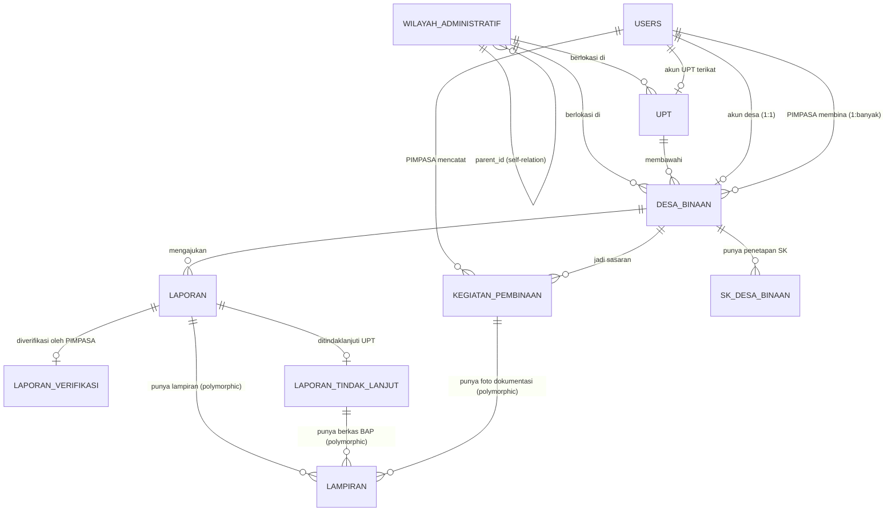

# schema.md — Database Schema SIMPEL DBI

Skema ini merinci seluruh tabel yang dibutuhkan sistem, disusun dari struktur data formulir (Bab VI dokumen spesifikasi), RBAC 4 level, siklus status laporan, dan SLA. Ditulis dalam gaya definisi migration Laravel (nama kolom, tipe, constraint) supaya bisa langsung diterjemahkan ke file migration.

---

## 1. Entity Relationship Diagram (Ringkas)

---

## 2. Tabel Referensi & Master Data

### `wilayah_administratif`
Hierarki wilayah: Provinsi → Kabupaten/Kota → Kecamatan → Desa. Self-relation via `parent_id`.

| Kolom | Tipe | Constraint | Keterangan |
|---|---|---|---|
| `id` | bigint | PK, auto-increment | |
| `parent_id` | bigint | FK → `wilayah_administratif.id`, nullable | null untuk level provinsi |
| `nama` | varchar(150) | not null | |
| `level` | enum(`provinsi`,`kabupaten_kota`,`kecamatan`,`desa`) | not null | |
| `kode_kemendagri` | varchar(20) | unique, not null | Standar Kemendagri sesuai spesifikasi |
| `created_at`, `updated_at` | timestamp | | |

**Index:** `(parent_id, level)`, unique `kode_kemendagri`.

### `upt`
Master Satuan Kerja UPT Imigrasi (11 UPT: 10 Kantor Imigrasi + 1 Rudenim Medan).

| Kolom | Tipe | Constraint | Keterangan |
|---|---|---|---|
| `id` | bigint | PK | |
| `nama` | varchar(150) | not null | mis. "Kantor Imigrasi Kelas I Medan" |
| `tipe` | enum(`kantor_imigrasi`,`rudenim`) | not null | |
| `wilayah_id` | bigint | FK → `wilayah_administratif.id` | |
| `created_at`, `updated_at` | timestamp | | |

### `desa_binaan`
Master 171 Desa Binaan Imigrasi.

| Kolom | Tipe | Constraint | Keterangan |
|---|---|---|---|
| `id` | bigint | PK | |
| `nama` | varchar(150) | not null | |
| `wilayah_id` | bigint | FK → `wilayah_administratif.id` (level desa) | |
| `upt_id` | bigint | FK → `upt.id` | UPT pembina wilayah |
| `pimpasa_id` | bigint | FK → `users.id`, nullable | PIMPASA yang ditugaskan (bisa kosong sebelum SK terbit) |
| `lat` | decimal(10,7) | nullable | untuk pin peta geospasial |
| `lng` | decimal(10,7) | nullable | |
| `status_terkini` | enum(`aman`,`perlu_pembinaan`,`ada_aduan`) | default `aman` | dihitung ulang berkala dari laporan aktif, dipakai warna pin peta |
| `created_at`, `updated_at` | timestamp | | |

**Index:** `(upt_id)`, `(pimpasa_id)`, `(wilayah_id)`.

### `sk_desa_binaan`
Penetapan SK Desa Binaan Imigrasi (Bab VI — Master Data Kanwil, poin 4).

| Kolom | Tipe | Constraint | Keterangan |
|---|---|---|---|
| `id` | bigint | PK | |
| `desa_id` | bigint | FK → `desa_binaan.id` | |
| `nomor_sk` | varchar(100) | not null | |
| `tanggal_sk` | date | not null | |
| `file_sk_path` | varchar(255) | not null | upload PDF |
| `created_at`, `updated_at` | timestamp | | |

---

## 3. Pengguna & RBAC

### `users`
Satu tabel untuk seluruh 4 role (dibedakan lewat `role` + relasi kontekstual). RBAC granular ditangani `spatie/laravel-permission` (tabel `roles`, `permissions`, `model_has_roles` — standar package, tidak didefinisikan ulang di sini).

| Kolom | Tipe | Constraint | Keterangan |
|---|---|---|---|
| `id` | bigint | PK | |
| `name` | varchar(150) | not null | |
| `email` | varchar(150) | unique, not null | |
| `password` | varchar(255) | not null | hashed |
| `role` | enum(`desa`,`pimpasa`,`upt`,`kanwil`) | not null | dipakai untuk scope query cepat, selain permission granular Spatie |
| `desa_id` | bigint | FK → `desa_binaan.id`, nullable | terisi hanya jika `role = desa` |
| `upt_id` | bigint | FK → `upt.id`, nullable | terisi hanya jika `role = upt` |
| `nip` | varchar(30) | nullable, unique | wajib diisi jika `role = pimpasa` (Master Data PIMPASA, Bab VI) |
| `golongan` | varchar(20) | nullable | khusus PIMPASA |
| `kontak` | varchar(30) | nullable | nomor HP/WA, khusus PIMPASA |
| `is_active` | boolean | default true | untuk nonaktifkan akun tanpa hapus data histori |
| `created_at`, `updated_at` | timestamp | | |

**Index:** `(role)`, `(desa_id)`, `(upt_id)`.

---

## 4. Alur Laporan (Inti Sistem)

### `laporan`
Tabel utama — satu baris per laporan yang diajukan Desa.

| Kolom | Tipe | Constraint | Keterangan |
|---|---|---|---|
| `id` | bigint | PK | |
| `kode_tiket` | varchar(30) | unique, not null | auto-generate, mis. `LP-2026-000123` |
| `desa_id` | bigint | FK → `desa_binaan.id`, not null | |
| `kategori` | enum(`kegiatan_dbi`,`wna`,`indikasi_tppo_pmi`,`insidentil`) | not null | sesuai dropdown Bab VI |
| `judul` | varchar(150) | not null | |
| `tanggal_kejadian` | datetime | not null | |
| `lokasi_detail` | varchar(100) | not null | Dusun/Lingkungan, RT/RW |
| `kronologi` | text | not null | |
| `estimasi_jumlah_orang` | integer | nullable | |
| `status` | enum(`diajukan`,`minta_perbaikan`,`diverifikasi`,`ditindaklanjuti`,`selesai`,`ditolak`) | default `diajukan`, not null | |
| `submitted_at` | timestamp | not null | |
| `verified_at` | timestamp | nullable | |
| `followed_up_at` | timestamp | nullable | |
| `resolved_at` | timestamp | nullable | |
| `sla_verifikasi_breached` | boolean | default false | true jika `verified_at - submitted_at > 48 jam` |
| `sla_tindak_lanjut_breached` | boolean | default false | true jika lewat 72 jam (umum) / 6 jam (TPPO/TPPM) |
| `red_flag` | boolean | default false | dihitung job terjadwal, ditampilkan di dashboard pimpinan |
| `created_at`, `updated_at` | timestamp | | |

**Index:** `(status)`, `(desa_id)`, `(kategori)`, `(red_flag)`, `(submitted_at)` — kombinasi ini dipakai berat oleh filter multi-dimensi dashboard Kanwil.

### `laporan_verifikasi`
Satu-ke-satu dengan `laporan` (hasil kerja PIMPASA).

| Kolom | Tipe | Constraint | Keterangan |
|---|---|---|---|
| `id` | bigint | PK | |
| `laporan_id` | bigint | FK → `laporan.id`, unique | 1:1 |
| `pimpasa_id` | bigint | FK → `users.id`, not null | |
| `checklist_validitas` | json | not null | boolean array kelengkapan bukti |
| `catatan` | text | nullable | wajib diisi jika keputusan bukan "Diverifikasi" |
| `keputusan` | enum(`diverifikasi`,`minta_perbaikan`,`ditolak`) | not null | |
| `created_at`, `updated_at` | timestamp | | |

### `laporan_tindak_lanjut`
Satu-ke-satu dengan `laporan` (hasil kerja UPT).

| Kolom | Tipe | Constraint | Keterangan |
|---|---|---|---|
| `id` | bigint | PK | |
| `laporan_id` | bigint | FK → `laporan.id`, unique | 1:1 |
| `nomor_registrasi` | varchar(30) | unique, not null | auto-generate |
| `seksi_penanggung_jawab` | enum(`intelkim`,`wasdakim`) | not null | |
| `bentuk_intervensi` | enum(`pengecekan_dokumen`,`pemanggilan`,`operasi_gabungan`) | not null | |
| `ringkasan_hasil` | text | not null | |
| `status_akhir` | enum(`dalam_proses`,`selesai`) | not null | |
| `ditangani_oleh` | bigint | FK → `users.id` | staf UPT yang input |
| `created_at`, `updated_at` | timestamp | | |

### `kegiatan_pembinaan`
Input mandiri PIMPASA — tidak terkait laporan Desa, jadi tabel independen.

| Kolom | Tipe | Constraint | Keterangan |
|---|---|---|---|
| `id` | bigint | PK | |
| `pimpasa_id` | bigint | FK → `users.id`, not null | |
| `desa_id` | bigint | FK → `desa_binaan.id`, not null | desa sasaran |
| `jenis_pembinaan` | enum(`sosialisasi`,`bimtek`,`rapat_koordinasi`,`sambang_desa`) | not null | |
| `tanggal` | date | not null | |
| `jumlah_peserta` | integer | not null | |
| `ringkasan_materi` | text | not null | |
| `created_at`, `updated_at` | timestamp | | |

**Index:** `(pimpasa_id, tanggal)` — dipakai modul Rekapitulasi Pembinaan.

### `lampiran`
Polymorphic — dipakai oleh `laporan` (foto/dokumen desa), `laporan_tindak_lanjut` (berkas BAP), dan `kegiatan_pembinaan` (foto dokumentasi).

| Kolom | Tipe | Constraint | Keterangan |
|---|---|---|---|
| `id` | bigint | PK | |
| `lampiranable_id` | bigint | not null | polymorphic |
| `lampiranable_type` | varchar(150) | not null | polymorphic (`App\Models\Laporan`, dst) |
| `path` | varchar(255) | not null | |
| `nama_file_asli` | varchar(255) | not null | |
| `tipe_file` | enum(`jpg`,`png`,`pdf`) | not null | |
| `ukuran_bytes` | integer | not null | validasi max 5MB di backend, bukan hanya frontend |
| `uploaded_by` | bigint | FK → `users.id` | |
| `created_at` | timestamp | | |

**Index:** `(lampiranable_id, lampiranable_type)`.

---

## 5. Audit Trail & Notifikasi

### `laporan_status_histories`
Mencatat setiap perubahan status laporan — memenuhi kebutuhan audit trail (Bab I poin "e": ketiadaan audit trail jadi salah satu masalah utama yang harus diselesaikan sistem ini).

| Kolom | Tipe | Constraint | Keterangan |
|---|---|---|---|
| `id` | bigint | PK | |
| `laporan_id` | bigint | FK → `laporan.id`, not null | |
| `status_dari` | varchar(30) | nullable | null untuk histori pertama |
| `status_ke` | varchar(30) | not null | |
| `actor_id` | bigint | FK → `users.id`, not null | siapa yang mengubah |
| `catatan` | text | nullable | |
| `created_at` | timestamp | | tidak ada `updated_at` — baris ini immutable |

**Aturan:** baris di tabel ini **tidak boleh di-update atau di-delete** dari aplikasi (append-only), sesuai prinsip auditabilitas di `PRD.md`.

### `notifications`
Tabel bawaan Laravel notification (`php artisan notifications:table`) — dipakai untuk red-flag alert & perubahan status, dikirim ke `users` (role UPT/Kanwil untuk red-flag, role Desa untuk update status laporannya).

---

## 6. Ringkasan Enum

| Enum | Nilai |
|---|---|
| `laporan.kategori` | `kegiatan_dbi`, `wna`, `indikasi_tppo_pmi`, `insidentil` |
| `laporan.status` | `diajukan`, `minta_perbaikan`, `diverifikasi`, `ditindaklanjuti`, `selesai`, `ditolak` |
| `laporan_verifikasi.keputusan` | `diverifikasi`, `minta_perbaikan`, `ditolak` |
| `laporan_tindak_lanjut.seksi_penanggung_jawab` | `intelkim`, `wasdakim` |
| `laporan_tindak_lanjut.bentuk_intervensi` | `pengecekan_dokumen`, `pemanggilan`, `operasi_gabungan` |
| `laporan_tindak_lanjut.status_akhir` | `dalam_proses`, `selesai` |
| `kegiatan_pembinaan.jenis_pembinaan` | `sosialisasi`, `bimtek`, `rapat_koordinasi`, `sambang_desa` |
| `desa_binaan.status_terkini` | `aman`, `perlu_pembinaan`, `ada_aduan` |
| `users.role` | `desa`, `pimpasa`, `upt`, `kanwil` |
| `wilayah_administratif.level` | `provinsi`, `kabupaten_kota`, `kecamatan`, `desa` |

---

## 7. Catatan Implementasi

- **Nomor tiket & registrasi** (`kode_tiket`, `nomor_registrasi`) di-generate lewat service khusus (`LaporanWorkflowService` — lihat `architecture.md`), bukan auto-increment biasa, supaya formatnya bisa mengikuti pola resmi (`LP-2026-000123`).
- **Perhitungan SLA** (`sla_verifikasi_breached`, `sla_tindak_lanjut_breached`, `red_flag`) diisi oleh job terjadwal (`CheckSlaBreaches`), bukan dihitung on-the-fly setiap request, supaya query dashboard tetap cepat.
- **`desa_binaan.status_terkini`** juga hasil kalkulasi berkala (bukan input manual) — aturan sederhana: `ada_aduan` jika ada laporan kategori kritis yang masih aktif, `perlu_pembinaan` jika sudah lama tidak ada `kegiatan_pembinaan`, selebihnya `aman`. Detail threshold-nya bisa disepakati lebih lanjut saat implementasi.
- Semua tabel transaksi (`laporan`, `laporan_verifikasi`, `laporan_tindak_lanjut`, `kegiatan_pembinaan`) pakai **soft delete** (`deleted_at`) — bukan hard delete — supaya konsisten dengan prinsip audit trail, meski secara default tidak terlihat di UI.
- Foreign key dari tabel besar (`laporan`) ke `desa_binaan` sebaiknya `restrict on delete` — desa binaan tidak boleh terhapus selama masih punya riwayat laporan.